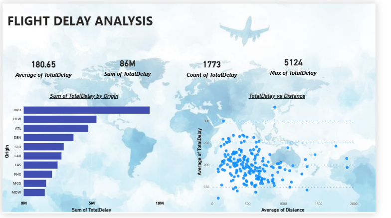

# Flight_delay_analysis
"Power BI Dashboard analyzing flight delays"
## Overview
This project analyzes flight delays using Power BI.
## Dashboard Preview

## Insights
- Most delays happen due to late aircraft
- Distance impacts arrival delay
- Certain airports have higher delays
